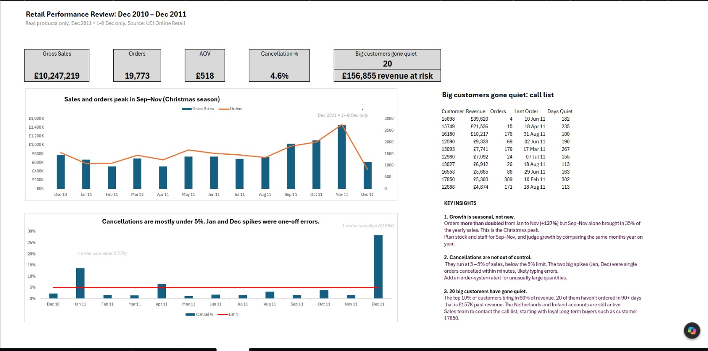

# Retail Performance Review (Excel)

Analysis of 540K transactions from a UK online gift wholesaler to answer a COO's question: *"We're busier than ever, but are we making more money? Have big customers gone quiet? Are cancellations out of control?"*

## Bottom line
The business is busier because of the Christmas season, not because something is wrong. Cancellations are under control, but 20 big customers have stopped buying and should be contacted.

## Key findings
- **Growth is seasonal:** orders +137% from Jan to Nov 2011. Sep–Nov brought in 35% of yearly sales.
- **Order size is stable:** average order value £436 → £453 (+4%).
- **Cancellations are under control:** 3–5% of sales. The two spikes were single orders cancelled within minutes (likely typing errors).
- **Customer concentration:** the top 10% of customers bring in 60% of identified revenue. 20 of them have been quiet for 90+ days (~£157K past revenue).

📄 Full write-up: [Executive summary](docs/executive_summary.md)

## Data
- **Source:** [UCI Online Retail dataset](https://archive.ics.uci.edu/dataset/352/online+retail)
- **Period:** 1 Dec 2010 – 9 Dec 2011
- **Size:** 541,909 rows raw → 534,131 after cleaning
- Raw file not uploaded because of its size. Download it and place it in `data/raw/`.
- The Excel workbook is too large for GitHub. The dashboard screenshot and docs show the full analysis.

## Approach
1. **Problem framing:** turned a vague brief into clear questions, metrics and definitions → [problem_framing.md](docs/problem_framing.md)
2. **Data profiling:** found missing customer IDs, cancellations, extreme quantities and non-product codes → [data_dictionary.md](docs/data_dictionary.md)
3. **Cleaning in Power Query:** fixed types, removed 5,268 duplicates and 2,510 £0 rows, and flagged cancellations and non-products instead of deleting them → [cleaning_log.md](docs/cleaning_log.md)
4. **Analysis with pivot tables:** monthly sales, orders, AOV, cancellation rate and customer concentration → [findings.md](docs/findings.md)
5. **Dashboard:** KPI cards, combo charts, a self-updating call list (FILTER/SORT/TAKE) and key insights

## Tools and skills
- **Excel:** Power Query, PivotTables (Data Model, Distinct Count), PivotCharts, combo charts, conditional formatting, FILTER / SORT / TAKE / COUNTIF / SUMIF
- **Analysis:** problem framing, data profiling, outlier investigation, hypothesis testing
- **Communication:** executive summary, dashboard design, story-telling chart titles

## Limitations
- No cost data, so profit cannot be measured.
- The data shows *who* cancelled or stopped buying, not *why*.
- Dec 2011 is a partial month (1–9 Dec).
- 25% of rows have no customer ID (guest buyers). They are included in revenue but excluded from customer analysis.

## Repository structure
| Folder | Contents |
|---|---|
| `data/raw/` | Original data (not uploaded, see Data section) |
| `data/clean/` | Cleaned data |
| `docs/` | Problem framing, data dictionary, cleaning log, findings, executive summary |
| `excel/` | Workbook and dashboard |
| `images/` | Dashboard screenshot |

## Author
**Dolfine Ngare** · Data Analyst
